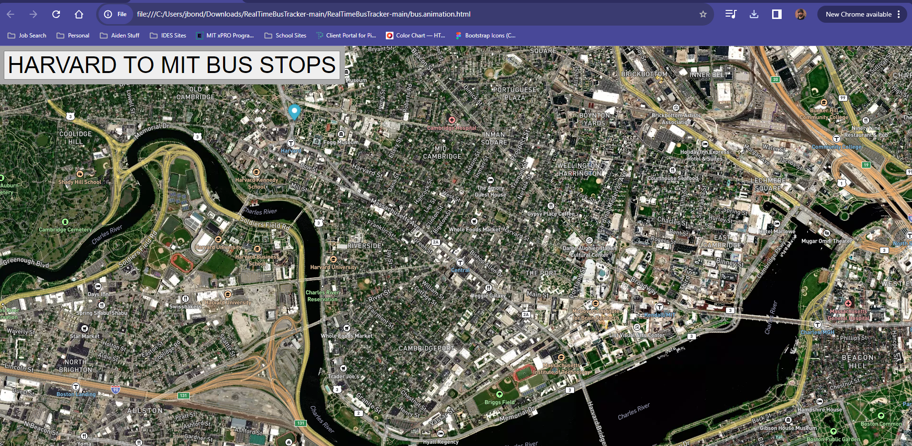

# RealTimeBusTracker

Module 9 - Bus Tracker Animation Assignment

Title of the project: Real Time Bus Tracker

Description of the project: This project uses an animated marker on a map to indicate the locations of all bus stops between Harvard and MIT.

INSTRUCTIONS TO OPEN THE EXERCISE: Download the Zip file then be sure to extract all the files. Once extracted, you just need to open the HTML file in your browser. *NOTE - If you have GitHub Desktop downloaded on your device you can open the repository using desktop without the need to extract the files.

How to Run: Load the bus.animation.html file to your browser and then click the button in the upper left-hand corner to view the bus stops along the route.

Roadmap of future improvements: Would like to add a link that user can click on to be directed to the bus schedule website.

License Information: MIT License 
Copyright (c) 2023 Jason Bondi

Permission is hereby granted, free of charge, to any person obtaining a copy
of this software and associated documentation files (the "Software"), to deal
in the Software without restriction, including without limitation the rights
to use, copy, modify, merge, publish, distribute, sublicense, and/or sell
copies of the Software, and to permit persons to whom the Software is
furnished to do so, subject to the following conditions:

The above copyright notice and this permission notice shall be included in all
copies or substantial portions of the Software.

THE SOFTWARE IS PROVIDED "AS IS", WITHOUT WARRANTY OF ANY KIND, EXPRESS OR
IMPLIED, INCLUDING BUT NOT LIMITED TO THE WARRANTIES OF MERCHANTABILITY,
FITNESS FOR A PARTICULAR PURPOSE AND NONINFRINGEMENT. IN NO EVENT SHALL THE
AUTHORS OR COPYRIGHT HOLDERS BE LIABLE FOR ANY CLAIM, DAMAGES OR OTHER
LIABILITY, WHETHER IN AN ACTION OF CONTRACT, TORT OR OTHERWISE, ARISING FROM,
OUT OF OR IN CONNECTION WITH THE SOFTWARE OR THE USE OR OTHER DEALINGS IN THE
SOFTWARE.
